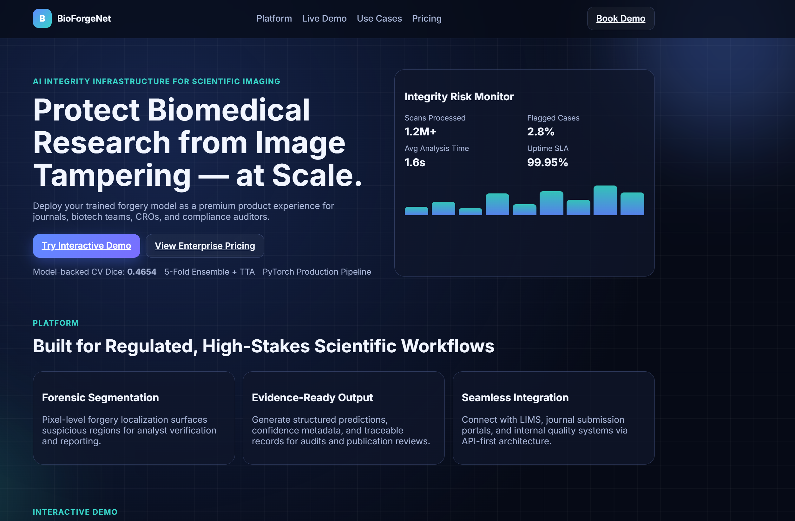
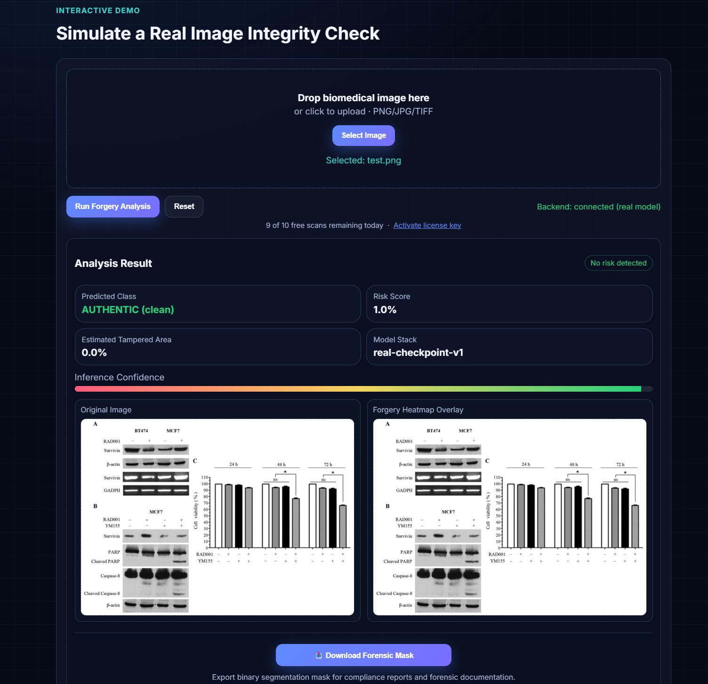
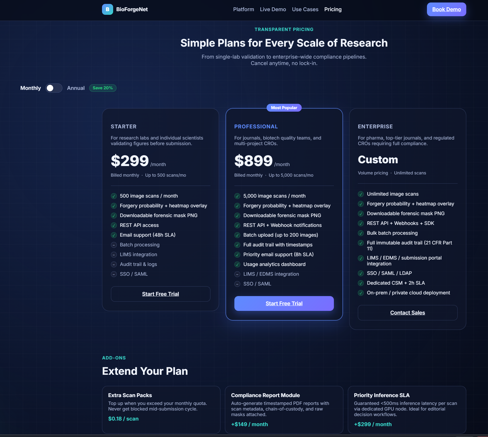
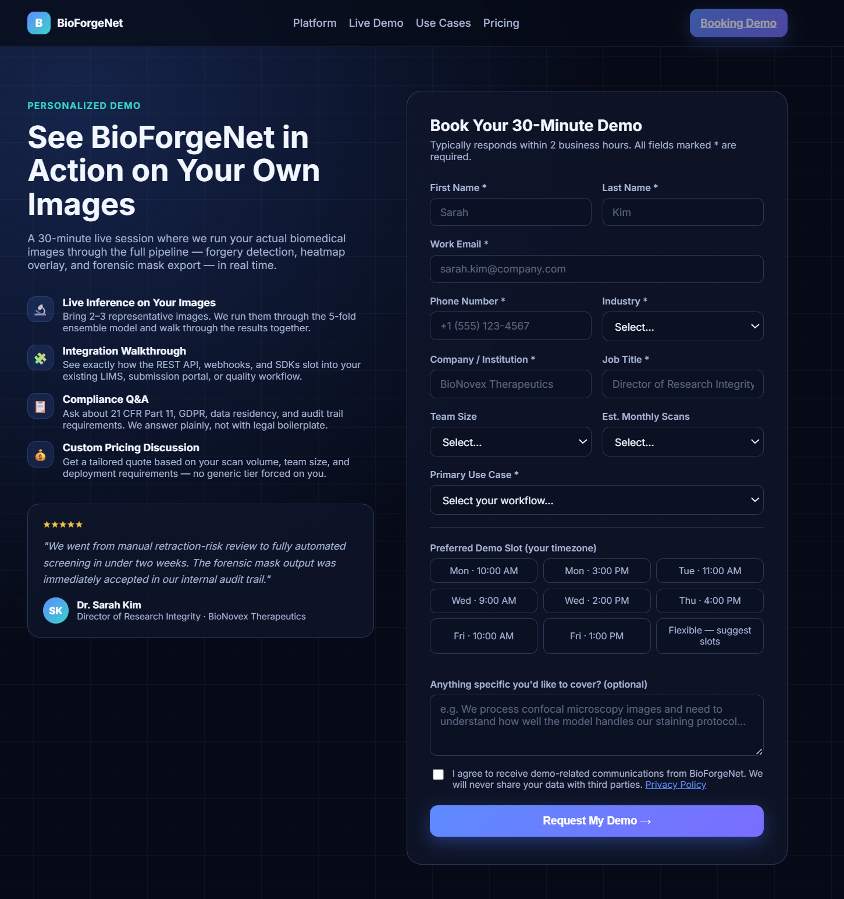
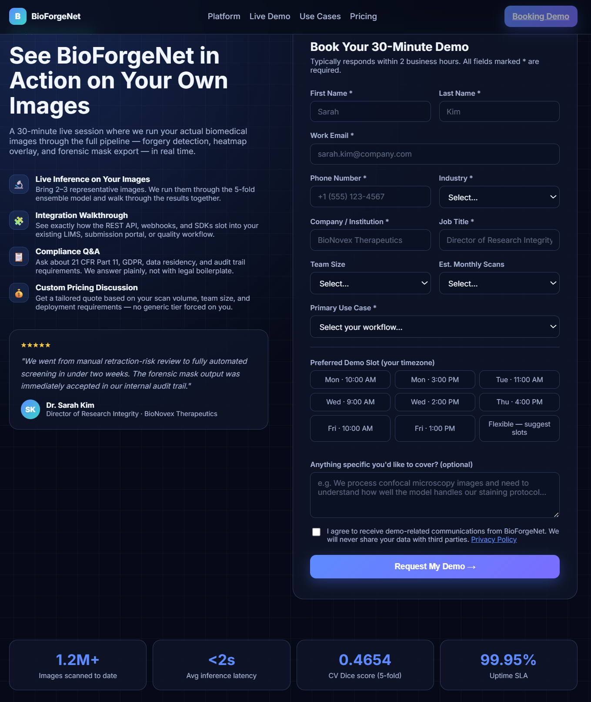

# BioForgeNet

Scientific image-forgery detection platform with production API serving, segmentation masks, and enterprise-grade fallback architecture.

[](https://bioforgenet.live/)
[](https://bioforgenet.live/)
[](LICENSE)
[](CONTRIBUTING.md)

## What this project does

BioForgeNet detects and localizes tampered regions in biomedical images.

- Input: microscopy/scientific images (`.png`, `.jpg`, `.tiff`)
- Output: authenticity prediction, risk score, tamper area %, confidence, and downloadable forensic mask PNG
- Delivery: web frontend + FastAPI backend with real-model and fallback execution modes

## Why this matters

Research integrity teams and quality operations need fast, repeatable forensic screening before publication, submission, and compliance reviews. BioForgeNet turns that into an API-first workflow that can run in constrained environments.

## Quantitative highlights

- 5-fold model ensemble deployed (`best_fold0` through `best_fold4`)
- 4 TTA inference paths (original + spatial flips/rotations)
- 4 production API endpoints (`/health`, `/model-status`, `/analyze`, `/analyze-mask`)
- Dual-provider deployment architecture (Hugging Face + Render)
- End-to-end booking flow reliability hardened with HTTP delivery fallback

## Architecture (high-level)

1. **Frontend** (`website/index.html`, `website/script.js`)
    - Upload, analyze, visualize confidence/risk, download mask

2. **Backend API** (`website/api/app.py`)
    - FastAPI service for health, status, prediction, and mask export
    - Thread-safe model initialization for stable startup under probe/load concurrency

3. **Model runtime** (`src/`)
    - Segmentation models with ensemble + TTA + postprocessing

4. **Deployment pattern**
    - HF Space as primary real-checkpoint serving
    - Render backup path + graceful fallback behavior

## Features

### ML/Inference
- Ensemble inference across 5 fold checkpoints
- Test-time augmentation + postprocessing pipeline
- Forensic binary mask generation and export

### Product/API
- Real-time API health and model-status introspection
- Fallback-safe operation when checkpoints/env are unavailable
- CORS-safe frontend/backend integration

### Reliability & Problem Solving
- Diagnosed and fixed checkpoint availability/runtime auth issues
- Added startup race-condition protection in model initialization
- Replaced SMTP dependency with Formspree HTTP flow to bypass blocked outbound SMTP

## Product Screenshots

This section is designed for product showcase visuals with concise captions.

> Screenshot source folder: `product_ss/`

### 1) Landing Page / Hero
**Caption:** Premium product landing experience with live model status, product narrative, and enterprise positioning.


### 2) Demo Upload Flow
**Caption:** Drag-and-drop image upload with guided user actions and one-click forgery analysis.


### 3) Analysis Result View
**Caption:** Model output with prediction, risk score, confidence, tampered-area metrics, and visual mask output.


### 4) API Pricing


### 5) Book Demo / Lead Capture
**Caption:** Conversion-focused demo booking workflow with resilient delivery path and production fallback handling.



### 6) Booking Confirmation
**Caption:** User confirmation state after successful booking request capture.



## Tech stack

- **ML/CV:** PyTorch, Segmentation Models PyTorch, Albumentations, OpenCV
- **Backend:** FastAPI, Uvicorn, Pydantic
- **Frontend:** HTML/CSS/JavaScript
- **Infra/DevOps:** Hugging Face Spaces, Render, GitHub

## Repository structure

```
src/                    # Training + inference pipeline
website/                # Product website + API service
outputs/                # Model artifacts/checkpoints (local, ignored)
notebook.ipynb          # Experiment/training notebook
ARCHITECTURE.md         # System-level notes
QUICKSTART.md           # Local run guidance
```

## Code access policy

Please read [CODE_ACCESS_POLICY.md](CODE_ACCESS_POLICY.md) before reuse, redistribution, or production adaptation.

## Contributing

Contribution process and repo workflow are documented in [CONTRIBUTING.md](CONTRIBUTING.md).

## License

This repository is governed by [LICENSE](LICENSE).

## Notes for recruiters / reviewers

This project showcases:

- ML model serving in production conditions
- Cloud deployment debugging under infrastructure limits
- Fault-tolerant backend design and pragmatic fallback strategies
- Full-stack productization from model output to user-facing UX
